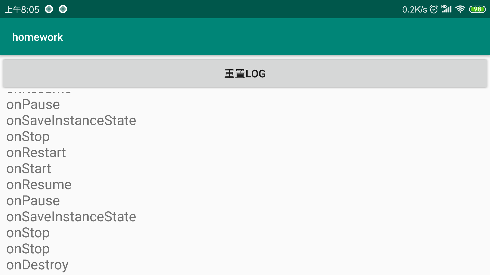
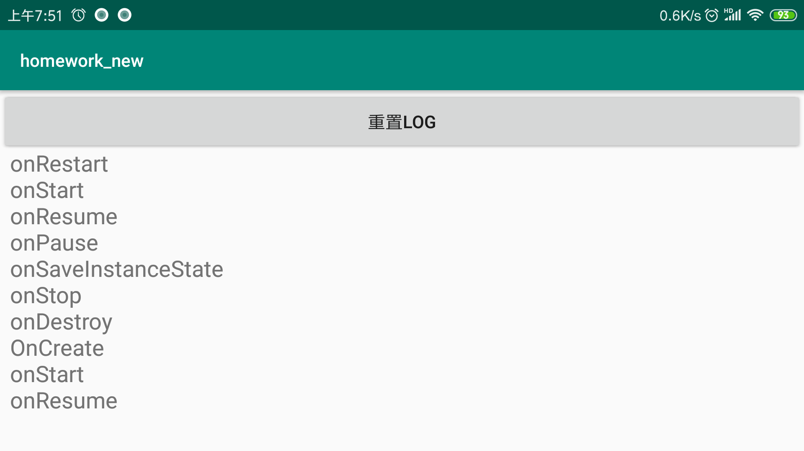
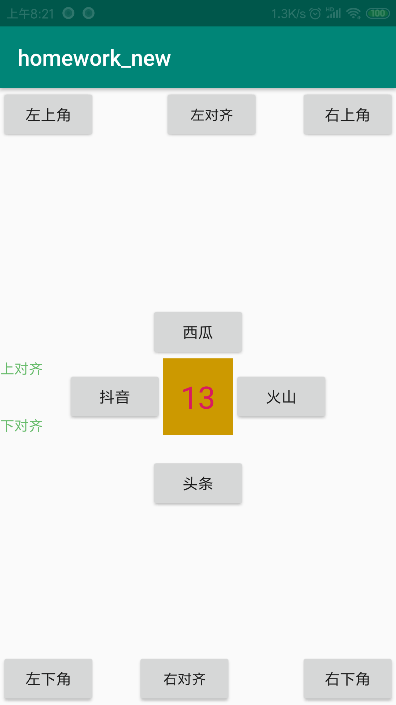
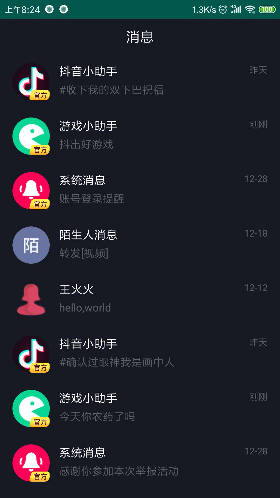
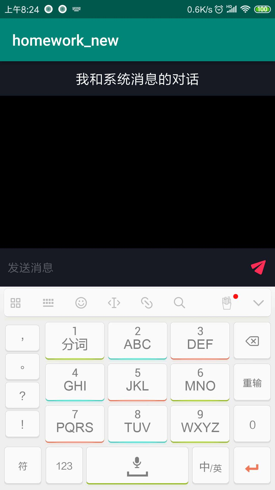

# chapter1
Android基础UI开发

* app:课堂代码
* homework:课后作业
* homework-debug.apk 是课后作业的示例，
(可以使用adb install -t homework-debug.apk 进行安装)

* Android基础UI开发.pdf 是随堂课件

## UI的标注资源 请参考这里：

https://app.zeplin.io/project/5c402caf0c6b0938570c4953/screen/5c402eaf5838d5bff1178c68

* 账号：397717749@qq.com
* 密码：123456

## 作业完成情况记录

### Exercise1
Logcat在屏幕旋转的时候 #onStop() #onDestroy()会展示出来，但UI界⾯
我们看不到，在SaveInstanceStateActivity基础上想办法补全它，让其跟
Logcat的展示⼀样,最终效果如图：

**解决思路**：使用一个static对象（如ArrayList）存储SaveInstanceState记录不到的onStop、onDestroy事件。因为static对象的生命周期更长，类被加载到虚拟机，除非class被回收，static对象生命周期才结束。（static对象生命周期理解可能有些偏差）

在运行老师给的homwwork demo时发现一个问题，（操作复现：先按home退出app，即使当前activity不可见，再回到App的exercise1 activity,然后再进行旋转屏幕操作，发现记录了两个onStop事件，Logcat日志信息没有问题），如下图所示：

<p align="center">
    
    <p align="center">
        <em>App Demo</em>
    </p>
</p>

对应的logcat信息：
```
2019-01-20 08:10:31.849 22561-22561/? D/wangyi: Lifecycle Event: onCreate
2019-01-20 08:10:31.851 22561-22561/? D/wangyi: Lifecycle Event: onStart
2019-01-20 08:10:31.853 22561-22561/? D/wangyi: Lifecycle Event: onResume
2019-01-20 08:10:33.527 22561-22561/? D/wangyi: Lifecycle Event: onPause
2019-01-20 08:10:33.577 22561-22561/? D/wangyi: Lifecycle Event: onSaveInstanceState
2019-01-20 08:10:33.580 22561-22561/? D/wangyi: Lifecycle Event: onStop
2019-01-20 08:10:38.062 22561-22561/? D/wangyi: Lifecycle Event: onRestart
2019-01-20 08:10:38.065 22561-22561/? D/wangyi: Lifecycle Event: onStart
2019-01-20 08:10:38.069 22561-22561/? D/wangyi: Lifecycle Event: onResume
2019-01-20 08:10:43.919 22561-22561/? D/wangyi: Lifecycle Event: onPause
2019-01-20 08:10:43.922 22561-22561/? D/wangyi: Lifecycle Event: onSaveInstanceState
2019-01-20 08:10:43.926 22561-22561/? D/wangyi: Lifecycle Event: onStop
2019-01-20 08:10:43.928 22561-22561/? D/wangyi: Lifecycle Event: onDestroy
2019-01-20 08:10:43.998 22561-22561/? D/wangyi: Lifecycle Event: onCreate
2019-01-20 08:10:43.999 22561-22561/? D/wangyi: Lifecycle Event: onStart
2019-01-20 08:10:44.003 22561-22561/? D/wangyi: Lifecycle Event: onResume

```

经过分析发现，因为每次在onCreate中恢复完Log信息后要清空历史信息（即清空ArrayList），猜测可能是清空static对象的时机不对，通过把static对象的清空时机放在onResume方法中，因为activity不可见时也会往静态list插入日志信息（调用流程: onStop->onRestart->onStart->onResume），需要在显示activity时抹去脏数据，只记录屏幕旋转等操作重建activity操作的#onStop() #onDestroy()日志信息。

最终效果如下图所示：
<p align="center">
    
    <p align="center">
        <em>App Demo</em>
    </p>
</p>

### Exercise2
一个抖音笔试题：统计页面所有view的个数
 * Tips：ViewGroup有两个API
 * {@link android.view.ViewGroup #getChildAt(int) #getChildCount()}
 * 用一个TextView展示出来 

 解决思路：View和ViewGroup实际上是一个Tree的结构，获取布局文件的根View，再通过递归或非递归方法对该树进行深度或者广度优先遍历就好了，遍历的过程记录下View的个数，本次采用了递归的深度优先遍历。

 效果如下所示：

 <p align="center">
    
    <p align="center">
        <em>App Demo</em>
    </p>
</p>


### Exercise3
大作业:实现一个抖音消息页面,所需资源已放在res下面

解决思路：
* 根据tips.xml,先绘制消息界面和聊天界面（点击消息触发跳转操作）布局；
* 继承RecyclerView.Adapter实现一个自定义的Adapter,重现onBindViewHolder、onBindViewHolder、getItemCount方法.
* 继承RecyclerView.ViewHolder实现一个ViewHolder，即将可见的View与message对象建立联系。
* 完成RecyclerView的一系列代码设置操作
* 在获取聊天对象的头像过程中，设置了一个AvatartUtil工具类，通过icon的属性（如：TYPE_STRANGER）,获取对应的drawable资源


最终效果：

<p align="center">
    
    <p align="center">
        <em>App Demo</em>
    </p>
</p>


<p align="center">
    
    <p align="center">
        <em>App Demo</em>
    </p>
</p>


